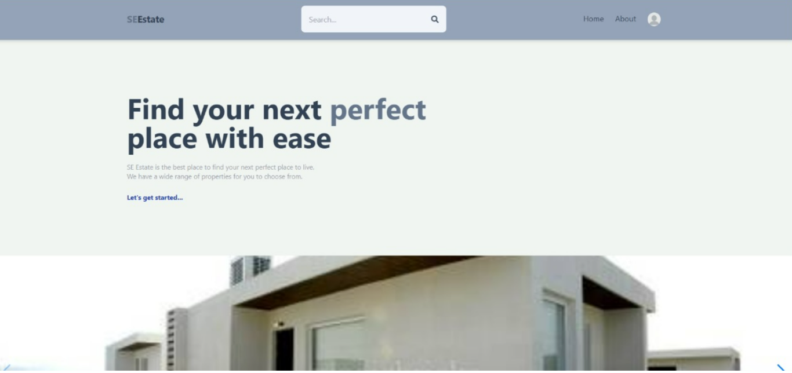
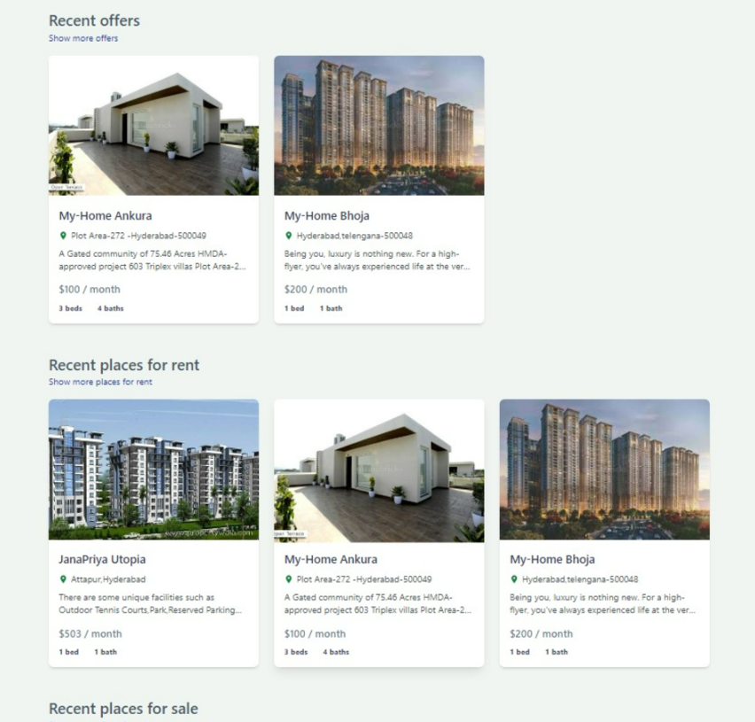
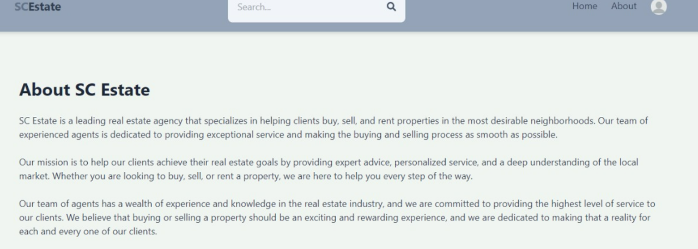

Here’s a README file for your **Real Estate Marketplace** project with placeholders for screenshots:  

---

# 🏠 Real Estate Marketplace  

## 🌟 Overview  
The **Real Estate Marketplace** is a modern platform designed to connect property owners with potential buyers seamlessly. Built on the **MERN stack** (MongoDB, Express.js, React, Node.js), this secure and intuitive application streamlines property listing, search, and management.  

---

## 🔑 Key Features  
### 🔒 Authentication & Security  
- Secure user login via **JWT, Firebase Authentication, and Google OAuth**.  
- Enhanced privacy and secure data handling.  

### 🏡 Property Listings  
- Owners can **add, update, or delete** property listings with detailed descriptions and high-quality images.  

### 🔍 Advanced Filters  
- Buyers can search for properties by **price range, location, and type**.  

### 🌍 Geo-Mapping  
- Interactive maps to display property locations and nearby amenities.  

### 📷 Image Galleries  
- High-resolution image uploads for a rich browsing experience.  

### 📞 Seamless Communication  
- Built-in messaging system for buyers and owners to connect easily.  

---

## 🧩 Components  

### 🏠 **Homepage (Hero Page)**  
Welcome message and **search bar** to start exploring properties.  
  

### 🌟 **Top Property Listings**  
Showcasing the most viewed or premium properties.  
  

### 🎯 **Filters Section**  
Advanced search filters for narrowing down results.  
  

### 💼 **About Us Page**  
Overview of the platform's mission, team, and future goals.  
  

---

## 🛠️ How to Use  
1️⃣ Clone the repository:  
```bash
git clone https://github.com/your-repo/real-estate-marketplace.git
```  

2️⃣ Navigate to the project directory:  
```bash
cd real-estate-marketplace
```  

3️⃣ Install dependencies:  
```bash
npm install
```  

4️⃣ Start the application:  
```bash
npm start
```  

5️⃣ Open your browser and navigate to:  
```
http://localhost:3000
```  

---

## 💻 Technologies Used  
- **Frontend**: React.js, Bootstrap, Material-UI  
- **Backend**: Node.js, Express.js  
- **Database**: MongoDB  
- **Authentication**: JWT, Firebase, Google OAuth  
- **Deployment**: AWS, Heroku  

---

## 🚀 Future Improvements  
- 📱 **Mobile Apps**: Develop iOS and Android versions.  
- 🤖 **AI Recommendations**: Personalized property suggestions.  
- 🏘️ **Social Features**: Community-driven interactions.  
- 🛋️ **Virtual Tours**: Immersive property walkthroughs.  

---

## 📞 Contact  
For collaboration or queries, reach out to:  
**Chaitanya Sai Nutakki**  
✉️ [Email Me](mailto:chaitanya@example.com)  
💼 [LinkedIn](https://linkedin.com/in/chaitanya-sai-nutakki)  
